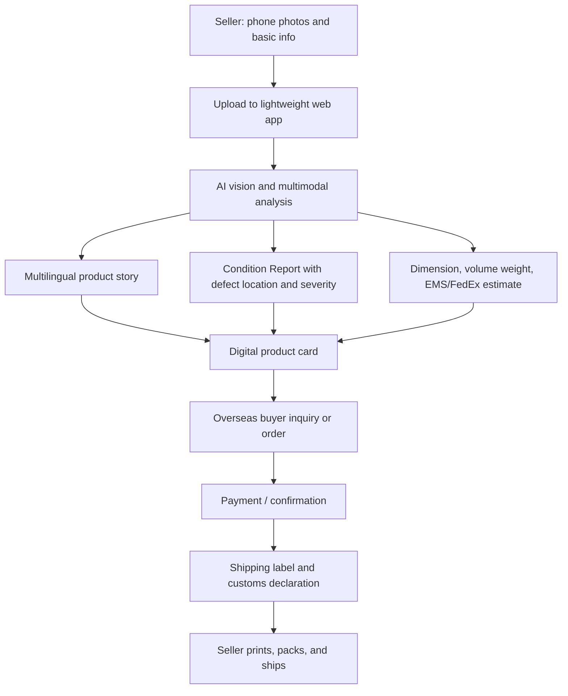

# 華山有田焼 Second Selection 海外平台 Project Brief

## 1. Project Background

Li is exploring an overseas sales platform for authorized `Second Selection` Arita-yaki from Kazan / 華山. The opportunity comes from a real production-side problem: Arita makers can have many pieces with small visual or production differences that do not meet first-grade retail standards, yet still retain brand lineage, material value, and practical use value.

The store owner has authorized overseas sales under the Kazan brand. This makes brand stewardship central. The platform must not look like a bargain-bin outlet or generic ecommerce site. It should present the pieces as culturally grounded, transparently documented, and suitable for professional dining environments.

The first audience is overseas Japanese restaurant chefs, restaurant buyers, and high-end collectors who value Arita-yaki, Japanese craft, and wabi-sabi-like appreciation of subtle variation. Priority markets are Taiwan, Australia, and the United States.

## 2. Brand Positioning

The platform should communicate:

- Kazan / 華山 as the single brand focus.
- Li / the operating entity as an authorized overseas sales partner.
- Arita-yaki as cultural heritage, not just tableware inventory.
- Second Selection as transparent, condition-documented pieces, not cheap outlet goods.
- Inquiry-first purchasing, with demo prices allowed only for experience simulation.

Preferred wording is `Second Selection` or condition-documented selection. Avoid leading with `B-grade`, `outlet`, or wording that damages the brand.

## 3. Product Experience

The site should feel like a small overseas private gallery or museum archive for Kazan Arita-yaki.

The first impression should be cultural and historical, not commercial. The culture/heritage page should act as the first page or primary entry. Collection pages should come after the visitor has understood Kazan, Arita, and the meaning of condition transparency.

Default language is Japanese. English and Chinese should also be available.

The visual direction is `Arita Heritage / Museum Chronicle`:

- Arita indigo and porcelain white as the core palette.
- Museum-like restraint, spacing, and narrative rhythm.
- Archival imagery and authentic source materials where possible.
- No cheap AI-template look.
- No ordinary marketplace or discount-sale atmosphere.

## 4. Current Demo Scope

The current phase is frontend-only demo work. Backend, seller dashboard, real payments, real logistics integrations, and live inventory management are intentionally postponed.

The demo may include placeholder products, demo pricing, estimated shipping, and reference images from public web sources. These must be clearly treated as demo/reference materials and replaced or confirmed with the shop owner before formal commercial release.

Current demo should support a clickable multi-page flow:

- Heritage / culture first page.
- Collection listing.
- Product detail pages.
- Condition Report explanation.
- Chef / buyer inquiry page.
- Selection or inquiry list.
- Market selector for priority overseas markets.
- Language selector for Japanese, English, and Chinese.

## 5. High-Level Business Flow

### Seller Side

1. Kazan shop owner or operator photographs individual pieces by phone.
2. Seller uploads photos and simple measurements to a lightweight web interface.
3. AI reads the images and generates:
   - Product name.
   - Multilingual description.
   - Condition Report.
   - Defect location and severity notes.
   - Suggested use cases for restaurants.
4. System estimates dimensions, weight, volume weight, and shipping cost.
5. Seller reviews and approves the generated product card.
6. Product card is published to a private overseas gallery or independent site.

### Buyer Side

1. Overseas chef, restaurant buyer, or collector views heritage context first.
2. Buyer explores condition-documented pieces.
3. Buyer can inquire about one item or multiple items.
4. Buyer sees demo price, estimated shipping, and condition information.
5. Buyer confirms interest or places an order after communication.
6. In later phases, payment and logistics documents are generated automatically.

## 6. Target Automation Workflow

Long-term target:

## 7. Phased Implementation

### Phase 1: Frontend Demo

- Build a polished multilingual website demo.
- Establish visual identity and cultural narrative.
- Create clickable purchase/inquiry experience.
- Use placeholder/reference images and demo data.
- No backend required.

### Phase 2: Data Model and Admin Prototype

- Define product schema.
- Define condition report schema.
- Add seller-side upload form.
- Store product data locally or in a simple backend.
- Add manual review/edit before publishing.

### Phase 3: AI Listing Assistant

- Use image inputs to draft descriptions and condition reports.
- Generate Japanese, English, and Chinese copy.
- Suggest defect tags and buyer-facing condition language.
- Keep human approval mandatory before publication.

### Phase 4: Shipping and Compliance Support

- Add EMS/FedEx shipping estimates.
- Add packaging and volume-weight calculations.
- Add CN22/CN23-style customs information support.
- Add food-contact and destination-market compliance notes.

### Phase 5: Transaction and Operations

- Add inquiry management.
- Add order confirmation.
- Add payment flow if appropriate.
- Add label/document generation.
- Add seller notifications and fulfillment tracking.

## 8. Risk Principles

The platform must be honest about tradeoffs and risks:

- Shipping cost inversion: low item value plus high international shipping can make single-item orders unattractive.
- Brand dilution: overusing `B-grade`, `outlet`, or discount language can harm Kazan's image.
- Compliance: food-contact ceramics may require market-specific checks, especially for the United States.
- Photo accuracy: condition transparency depends on clear defect photography.
- Inventory uniqueness: single-piece or small-lot sales require careful stock handling.

When these issues arise, the preferred response is to state the risk clearly and propose a practical alternative, such as bundle recommendations, inquiry-first sales, condition tiers, or market-specific disclaimers.

## 9. AI and Copy Principles

Generated copy should avoid generic AI style. The tone should be precise, quiet, and gallery-like.

Good copy should:

- Explain cultural and practical value.
- Name condition differences directly.
- Avoid exaggeration.
- Use multilingual phrasing that sounds natural in each language.
- Speak to chefs and buyers who care about use, plating, and atmosphere.

## 10. Implementation Principle

All discussion should stay close to programmable implementation. Strategy, design, and trade decisions should eventually map to screens, data models, workflows, prompts, or operational checks.
